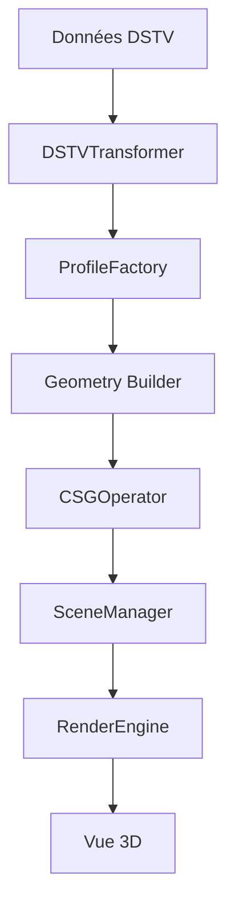

# Architecture du Système de Visualisation 3D

## 🎯 Objectifs
- Séparation claire des responsabilités
- Réutilisabilité des composants
- Support natif DSTV
- Performance optimisée
- Extensibilité

## 📦 Structure Proposée

```
3DViewer/
├── core/                      # Cœur du système 3D
│   ├── Scene/
│   │   ├── SceneManager.ts   # Gestion de la scène Three.js
│   │   ├── LightingSystem.ts # Système d'éclairage
│   │   └── CameraManager.ts  # Gestion caméra et contrôles
│   │
│   ├── Materials/
│   │   ├── MaterialFactory.ts     # Factory pour les matériaux
│   │   ├── SteelMaterial.ts      # Matériau acier PBR
│   │   └── HoleMaterial.ts       # Matériau pour les trous
│   │
│   └── Renderer/
│       ├── RenderEngine.ts       # Moteur de rendu
│       └── PostProcessing.ts     # Effets post-processing
│
├── geometry/                   # Générateurs de géométrie
│   ├── profiles/              # Profils métalliques
│   │   ├── ProfileFactory.ts # Factory principal
│   │   ├── IProfileBuilder.ts
│   │   ├── UProfileBuilder.ts
│   │   ├── LProfileBuilder.ts
│   │   └── TubeProfileBuilder.ts
│   │
│   ├── features/              # Features (trous, grugeages, etc.)
│   │   ├── HoleGenerator.ts
│   │   ├── NotchGenerator.ts
│   │   └── CutGenerator.ts
│   │
│   └── csg/                   # Opérations CSG
│       ├── CSGOperator.ts
│       └── CSGCache.ts
│
├── dstv/                      # Système DSTV
│   ├── DSTVTransformer.ts    # Transformation coordonnées DSTV -> 3D
│   ├── DSTVValidator.ts      # Validation des données DSTV
│   └── FaceOrientation.ts    # Gestion des orientations par face
│
├── components/                # Composants React
│   ├── Viewer3D.tsx          # Composant principal
│   ├── ViewerControls.tsx    # Contrôles UI
│   ├── ViewerOverlay.tsx     # Overlay d'informations
│   └── ViewerContext.tsx     # Context API pour le viewer
│
├── services/                  # Services
│   ├── PartBuilder.ts        # Construction des pièces
│   ├── HoleService.ts        # Gestion des trous
│   └── ExportService.ts      # Export 3D (GLTF, STL, etc.)
│
├── types/                     # Types TypeScript
│   ├── geometry.types.ts
│   ├── dstv.types.ts
│   └── viewer.types.ts
│
└── utils/                     # Utilitaires
    ├── MathUtils.ts
    ├── ValidationUtils.ts
    └── PerformanceMonitor.ts
```

## 🔄 Flux de Données



## 📋 Responsabilités par Module

### Core
- **SceneManager**: Gestion centralisée de la scène Three.js
- **LightingSystem**: Configuration et animation de l'éclairage
- **CameraManager**: Positionnement et contrôles de caméra
- **RenderEngine**: Boucle de rendu optimisée

### Geometry
- **ProfileFactory**: Création de profils selon le type
- **HoleGenerator**: Génération et positionnement des trous
- **CSGOperator**: Opérations booléennes optimisées

### DSTV
- **DSTVTransformer**: Conversion DSTV → coordonnées 3D
- **FaceOrientation**: Gestion des 6 faces et leurs systèmes de coordonnées

### Components
- **Viewer3D**: Composant React principal
- **ViewerContext**: État partagé via Context API

## 🚀 Avantages
1. **Modularité**: Chaque module a une responsabilité unique
2. **Testabilité**: Modules indépendants facilement testables
3. **Performance**: Cache CSG, LOD, instancing
4. **Extensibilité**: Ajout facile de nouveaux profils/features
5. **Maintenabilité**: Code organisé et documenté